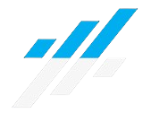

<!-- Logo proyecto -->

## Bienvenid@s a **Grow Bank**
Banca digital diseñada para satisfacer tus necesidades financieras de forma segura y conveniente. Accede a tu cuenta desde cualquier dispositivo, realiza transferencias seguras y recibe alertas instantáneas para mantener tus finanzas protegidas y optimizadas.

##  Acerca del proyecto

Grow Bank es una plataforma de banca digital que ofrece una solución completa para **usuarios individuales, empresas y administradores**. Con un enfoque en la seguridad y la conveniencia, Grow Bank permite a los usuarios acceder a sus cuentas desde cualquier dispositivo, realizar transferencias seguras y recibir alertas en tiempo real sobre actividades sospechosas y transacciones. Nuestra plataforma proporciona autenticación segura de usuarios, visualización de saldo y movimientos, así como transferencias bancarias en línea. Con Grow Bank, estamos comprometidos a brindar una experiencia bancaria digital excepcional, permitiendo a nuestros usuarios gestionar sus finanzas de manera eficiente y segura, en cualquier momento y desde cualquier lugar. **¡Únete a Grow Bank hoy mismo y descubre el futuro de la banca digital!.**

## VISTAS

## Tecnologías Usadas

### Front-End

  
  
  
  
  
  
  
 

### Back-End

  
  
  
  
  
  
  
  

### Deploy 🚀

  
   

### UX-UI

  

## Organización

En nuestro equipo, hemos adoptado un enfoque estructurado y colaborativo para organizar y gestionar nuestras tareas, lo que nos permite trabajar de manera eficiente y mantener un alto nivel de productividad. Nuestra metodología se basa en la distribución de responsabilidades en tres equipos principales: Frontend, Backend y UX/UI.

  
  
  
  

## Team - [C17-36-M-JAVA]

### ⚛️ Front-End
| Nombre        | Github | Linkedin |
|---------------|--------|----------|
| Isis Daza     |  |  |
| Samuel Aquino |  |  |

### ⚛️ Back-End
| Nombre             | Github | Linkedin |
|--------------------|--------|----------|
| Heinner Vega       |  |  |
| Martín Perez       |  |  |
| Fabian Manrique    |  |  |

### ⚛️ UX/UI
| Nombre           | Github | Linkedin |
|------------------|--------|----------|
| Rodrigo Natanael |  |  |
| Cynthia Olocco   |  |  |

## Video

## Agradecimientos

  

